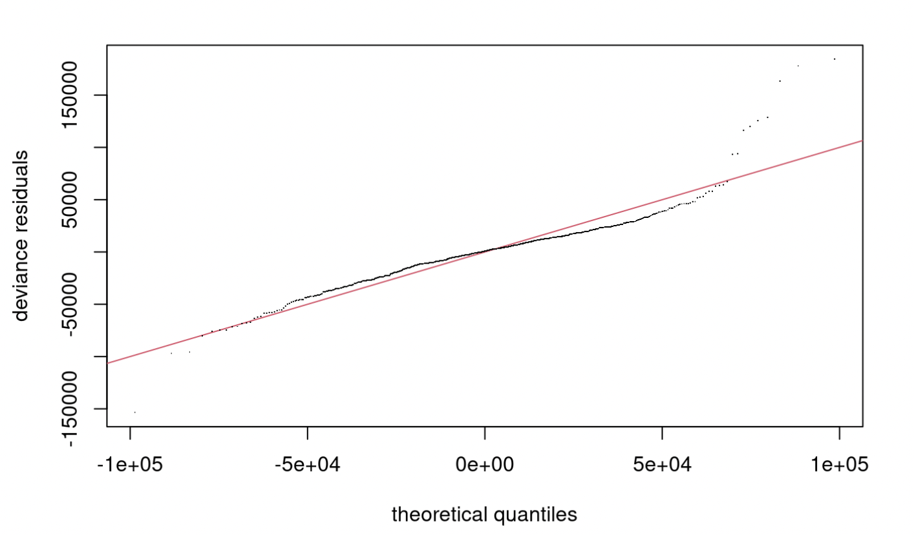
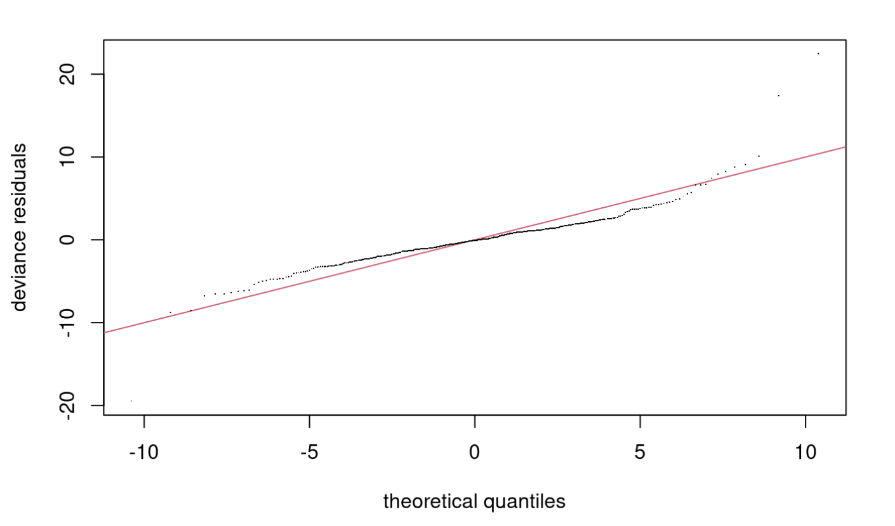

# Conclusion

Even though the RMSE from the boston final model was better than that of ames, we were still not satisfied with the result. 
The first problem is the low p-value for the basis k dimension from the boston final model. 
In the process of trying to increase the p-value, we had came across the possible explanation, that the concurvity of our model is too high.

```{r}
concurvity(boston_final_model,full=TRUE)
```

From the concurvity table, which shows how much each smooth is predetermined by all the other smooths,notice that for all variables except for `B`, all of the smooths has at least 0.8 of worst case concurvity. 
The problem with having concurvity is that, if two variables have high concurvity and form a perfect parabola with each other, the confidence interval would be really wide, and negatively affect the ability of model prediction. 

```{r}
concurvity(ames_final_model2,full=TRUE)
```

Here we can see the concurvity table of our second ames model. 
Similarly, this model also has some high worst case concurvities, but slightly less in nunmber compared to the boston model.




From both the Q-Q plots, we can see the problem with concurvity more clearly. 
Both models still have trends in the graph, but ames model performs a little better by being more linear. 

In conclusion, when using Generalized Additive models, it's a good idea to always check the concurvity within the models, even if you're getting very low RMSE values. 
It's possible that through using smoothing parameters, the RMSE lowers, but the existence of high concurvity would always be a bad sign in using GAM.


